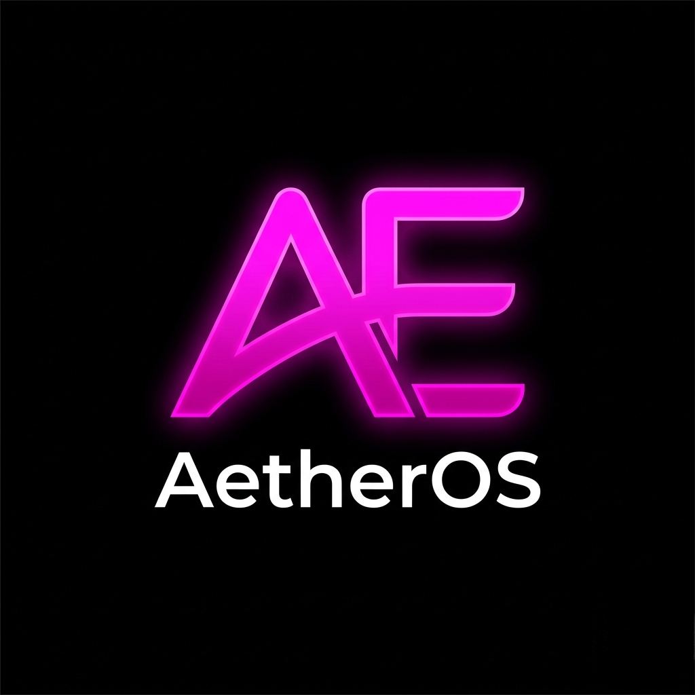

<div align="center">



# AetherOS

**AI-Powered Professional Network Intelligence — Secured on Bitcoin via Stacks**

[](https://stacks.co)
[](https://nextjs.org)
[](https://groq.com)
[](https://vercel.com)
[](LICENSE)

[Live App](https://aether-os-psi.vercel.app) · [Hiro Explorer](https://explorer.hiro.so/address/SPQ189E66S20X7ATY7794HBY6743JE9YJMCKHAEF)

</div>

---

## What is AetherOS?

AetherOS is an elite AI-powered professional networking intelligence platform built natively on the **Stacks blockchain** (Bitcoin L2). It combines a 7-step AI strategy engine with real on-chain infrastructure — smart contracts, Gaia decentralized storage, live Hiro API feeds, sBTC payments, and PoX stacking data.

Your strategies, your identity, your network, your reputation — all anchored to Bitcoin.

---

## Features

### 🧠 AI Strategy Engine
- Powered by **Groq** (`llama-3.3-70b-versatile`) with automatic model fallback chain.
- 7-step professional networking blueprint: target profiling, outreach angles, timing strategy, psychological edge analysis.
- Free tier (1 strategy) + Premium tier via `$AetherOS` token holdings.

### ✉️ AI Outreach Drafts
- `/api/outreach` generates ready-to-send LinkedIn DMs, X/Twitter DMs, cold emails, and follow-ups.
- Uses your CRM contact context to personalize each message.

### 🤝 sBTC Warm Intro Bounties (creator-funded)
- Pledge **sBTC** to source a warm introduction to a target person or company.
- Contributors submit intro proof; the creator approves and pays **wallet-to-wallet in sBTC**.
- Recorded on-chain via the **`aetheros-bounty-registry`** contract — **no platform custody**, no platform capital required.

### 🏅 On-Chain Certificate Badges (SBT)
- Non-transferable **Soulbound Token** certificates via **`aetheros-certificate-sbt`**.
- Tamper-proof, Bitcoin-secured reputation record of verified contributions and milestones.

### 🗂️ Gaia-First Private CRM
- Decentralized contact CRM stored on **Stacks Gaia** — owned by your wallet, not a centralized server.
- Track targets, notes, status, and AI-drafted outreach.

### ⛓️ Stacks Blockchain Integration
- **SIP-010 Token** — `$AetherOS` on Stacks mainnet (Clarity smart contract).
- **Staking contract** — lock tokens for XP multipliers, on-chain rank progression.
- **Governance** — on-chain proposals and voting.
- Live Hiro API feeds, sBTC balance tracking, and PoX stacking data.

---

## Deployed Smart Contracts (Stacks Mainnet)

| Contract | Address |
|---|---|
| `$AetherOS` token (SIP-010) | `SPQ189E66S20X7ATY7794HBY6743JE9YJMCKHAEF.AetherOS` |
| Staking | `SPQ189E66S20X7ATY7794HBY6743JE9YJMCKHAEF.aetheros-staking` |
| Certificate SBT | `SPQ189E66S20X7ATY7794HBY6743JE9YJMCKHAEF.aetheros-certificate-sbt` |
| Bounty Registry | `SPQ189E66S20X7ATY7794HBY6743JE9YJMCKHAEF.aetheros-bounty-registry` |

All contracts are written in **Clarity** (decidable, auditable) and deployed under one deployer address.

> **sBTC note:** Warm-intro bounty rewards are paid via the official mainnet sBTC SIP-010 token (`SP3K8BC0PPEVCV7NZ6QSRWPQ2JE9E5B6N3PA0KBR9.sbtc-token`) directly from creator to contributor on approval. The registry only records bounty state — it never holds funds.

---

## Tech Stack

- **Framework:** Next.js 15 (App Router) · React 18 · TypeScript
- **Styling:** Tailwind CSS · Framer Motion
- **Blockchain:** `@stacks/connect`, `@stacks/transactions`, `@stacks/network`, `@stacks/storage`
- **AI:** Groq inference API
- **Storage:** Stacks Gaia (decentralized) with lightweight fallback

---

## Local Development

```bash
npm install
cp .env.example .env.local   # add GROQ_API_KEY and any Firebase vars
npm run dev
```

Build:

```bash
npm run build
```

---

## Contract Deployment (via Termux / Stacks.js)

Contracts live in `/contracts`. Deploy scripts use Stacks.js v6. See `docs/TERMUX_DEPLOY.md` for the full mobile (Termux) walkthrough.

```bash
export STACKS_PRIVATE_KEY='your_key'   # never commit this
node scripts/deploy-sbt-mainnet.mjs
node scripts/deploy-registry-mainnet.mjs   # set a manual fee with FEE=10000 (0.01 STX)
```

---

## Wallet Support

| Wallet | Support |
|---|---|
| [Leather](https://leather.io) | ✅ Full |
| [Xverse](https://xverse.app) | ✅ Full |
| Any `@stacks/connect` wallet | ✅ Compatible |

---

## License

MIT © 2026 [0xward](https://github.com/0xward)

---

<div align="center">

Built with Clarity on Stacks · Secured by Bitcoin · Powered by Groq

**[Launch App →](https://aether-os-psi.vercel.app)**

</div>
